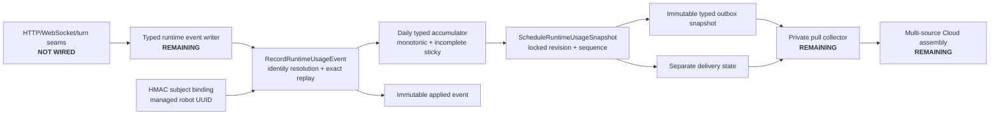

# Runtime Usage Outbox Boundary

Status date: `2026-09-13`

This boundary provides dormant, source-local PostgreSQL storage for privacy-safe runtime usage components. It
does not collect usage yet, does not contact a managed-service endpoint, and is not billing evidence.

Migration `011_create_runtime_usage_outbox.state.sql` creates five prefixed tables in the configured state
schema. Prefixing preserves the migration runner's isolated-schema integration model while allowing a later
deployment artifact to grant capabilities on only these objects.

The stored component is deliberately typed. It can contain successful/failed turns, bounded HTTP and WebSocket
counts/bytes, and input-audio bytes. There is no arbitrary JSON/blob payload and no column for a device ID,
serial, credential, customer, transcript, prompt, response, audio content, header, or provider payload.
Source identity is a 32-byte HMAC mapped administratively to the managed robot UUID; historical rows freeze the
UUID and bindings can only move from active to revoked.

`RecordRuntimeUsageEvent` resolves the binding for the event timestamp, rejects empty/negative deltas, records
the typed event once, detects conflicting reuse of an event UUID, and advances the accumulator in one database
transaction. An incomplete marker is sticky and a complete all-zero accumulator is invalid.

`ScheduleRuntimeUsageSnapshot` locks the accumulator, allocates its next database-owned sequence, copies only
the typed component fields to an immutable outbox row, creates pending delivery state, and advances the
scheduled revision atomically. Repeating a schedule when the revision has not advanced returns the existing
snapshot.

## Activation Boundary

This migration intentionally grants no runtime, binding-administrator, or collector role. The functions run
with invoker rights and are currently usable only by the database owner. Before activation:

1. add narrowly owned `SECURITY DEFINER` deployment wrappers with a pinned search path and separate roles;
2. implement binding administration and head-of-line claim/acknowledge/quarantine functions;
3. add the runtime writer without making customer requests fail solely because metering storage is unavailable;
4. durably mark the affected day incomplete after a source write outage;
5. prove concurrent replica, crash/retry, expired-lease, binding rotation, and least-privilege behavior in CI;
6. add the private collector and reconcile shadow output before enabling any final managed-service import.

Application Insights and diagnostic capture remain operational/debugging systems. They are aggregate or
best-effort and must not be parsed into this ledger.
