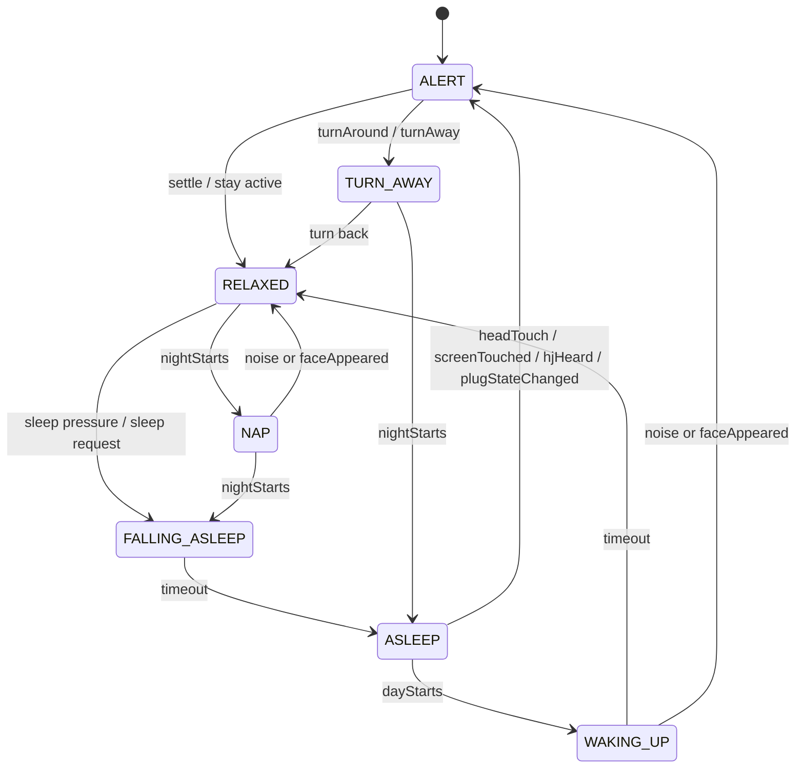

# System Diagram Alignment

## Purpose

This document maps the legacy Pegasus/Jibo cloud `system_diagram.png` architecture to the current OpenJibo `1.0.20` cloud.

Use it to keep release planning grounded in three views:

- where we were (legacy design intent)
- where we are (current hosted `.NET` implementation)
- where we are headed (next architecture slices)

As-of date: `2026-05-07`

## Diagram Inputs

- Legacy system architecture: `C:\Projects\jibo\pegasus\resources\system_diagram.png`
- Legacy generic skill scaffold: `C:\Projects\jibo\pegasus\packages\template-skill\docs\TemplateSkill.png`
- Legacy listener state machine: `C:\Projects\jibo\sdk\packages\skills-service-manager\resources\state-diagrams\glsm.png`

## Template Skill Verdict

The template-skill diagram is a generic scaffold, not a production behavior contract.

Evidence:

- `C:\Projects\jibo\pegasus\packages\template-skill\src\TemplateSkill.ts` is a starter graph (`Intent Split` -> `Do MIM` -> `Complete` -> `Done`).
- `C:\Projects\jibo\pegasus\packages\template-skill\src\nodes\MemoSplitNode.ts` uses placeholder memo validation (`SomeThing`).

Conclusion: do not treat template-skill flow as a port target. Treat it as a shape reference only.

## System Diagram Mapping

| Legacy block | OpenJibo `1.0.20` equivalent | Current gap / opportunity |
| --- | --- | --- |
| `Auth` | [JiboCloudProtocolService.cs](../src/Jibo.Cloud/dotnet/src/Jibo.Cloud.Application/Services/JiboCloudProtocolService.cs) (`CreateHubToken`, `CreateAccessToken`, account handlers) | move from in-memory/session stubs to durable tenant/account identity services |
| `Loop` | [JiboCloudProtocolService.cs](../src/Jibo.Cloud/dotnet/src/Jibo.Cloud.Application/Services/JiboCloudProtocolService.cs) (`HandleLoop`) + [InMemoryCloudStateStore.cs](../src/Jibo.Cloud/dotnet/src/Jibo.Cloud.Infrastructure/Persistence/InMemoryCloudStateStore.cs) | richer loop/member lifecycle and onboarding flows |
| `Hub` | [JiboWebSocketService.cs](../src/Jibo.Cloud/dotnet/src/Jibo.Cloud.Application/Services/JiboWebSocketService.cs) + [WebSocketTurnFinalizationService.cs](../src/Jibo.Cloud/dotnet/src/Jibo.Cloud.Application/Services/WebSocketTurnFinalizationService.cs) | split hub responsibilities into clearer protocol, routing, and orchestration boundaries |
| `ASR Handler` | STT strategy selection in [WebSocketTurnFinalizationService.cs](../src/Jibo.Cloud/dotnet/src/Jibo.Cloud.Application/Services/WebSocketTurnFinalizationService.cs) + DI in [ServiceCollectionExtensions.cs](../src/Jibo.Cloud/dotnet/src/Jibo.Cloud.Infrastructure/DependencyInjection/ServiceCollectionExtensions.cs) | short-turn reliability, managed STT comparison, and better low-signal/noise handling |
| `Parser / Robust Parser` | rule-based intent resolution in [JiboInteractionService.cs](../src/Jibo.Cloud/dotnet/src/Jibo.Cloud.Application/Services/JiboInteractionService.cs) + focused state machines (personal report/chitchat) | deeper phrase import from Pegasus intents/entities plus ambiguity guardrails |
| `Skill Router` | [JiboInteractionService.cs](../src/Jibo.Cloud/dotnet/src/Jibo.Cloud.Application/Services/JiboInteractionService.cs) decision switch and local skill payload shaping | external skill routing config and safer declarative intent mapping |
| `Proactivity Selector` | weighted candidate selection in [JiboInteractionService.cs](../src/Jibo.Cloud/dotnet/src/Jibo.Cloud.Application/Services/JiboInteractionService.cs) + pending-offer session state in [WebSocketTurnFinalizationService.cs](../src/Jibo.Cloud/dotnet/src/Jibo.Cloud.Application/Services/WebSocketTurnFinalizationService.cs) | externalized proactivity catalog, cooldown policy, and broader category coverage |
| `Presence / Identity Context` | runtime context passthrough in [ProtocolToTurnContextMapper.cs](../src/Jibo.Cloud/dotnet/src/Jibo.Cloud.Application/Services/ProtocolToTurnContextMapper.cs) and turn metadata handling in [WebSocketTurnFinalizationService.cs](../src/Jibo.Cloud/dotnet/src/Jibo.Cloud.Application/Services/WebSocketTurnFinalizationService.cs) | normalize `runtime.perception` fields (`speaker`, `peoplePresent`, focused person) for greeting/proactivity policy decisions |
| `Skill Registry` | implicit in current code/routing | formal registry abstraction for local/cloud capabilities and manifest metadata |
| `History` | tenant-scoped memory store in [InMemoryPersonalMemoryStore.cs](../src/Jibo.Cloud/dotnet/src/Jibo.Cloud.Infrastructure/Persistence/InMemoryPersonalMemoryStore.cs) | durable multi-tenant persistence and history timeline/query support |
| `Lasso` provider aggregation | partial provider integration via weather provider wiring in [ServiceCollectionExtensions.cs](../src/Jibo.Cloud/dotnet/src/Jibo.Cloud.Infrastructure/DependencyInjection/ServiceCollectionExtensions.cs) | full aggregation service for weather/news/calendar/knowledge inputs |
| `Proactivity Catalog` | in-code candidate lists/weights | explicit catalog service with tuned weights and operator controls |
| `Audio Logs` | file telemetry sinks in infrastructure telemetry | hosted indexed capture/retention for multi-operator analysis |

## GLSM Listener Flow Alignment (`2026-05-06`)

Captured source:

- `C:\Projects\jibo\sdk\packages\skills-service-manager\resources\state-diagrams\glsm.png`

First OpenJibo support slice (implemented):

- explicit derived listener phases are now emitted in cloud diagnostics:
  - `HJ_LISTENING`
  - `LISTENING`
  - `WAIT_LISTEN_FINISHED`
  - `DISPATCH_DIALOG`
  - `PROCESS_LISTENER_QUEUE`
- turn telemetry now records `glsm_phase_transition` with previous/next state and trigger
- websocket telemetry now includes `glsmPhase` on binary, context, and turn-processed events
- stale pending-listen recovery is now implemented:
  - when a pending `LISTEN` stays open long enough with no context/audio, a new hotphrase listen can recover the stuck state before continuing

Current parity boundary:

- this slice focuses on listener lifecycle observability plus stuck-listen recovery
- deeper explicit parity states from GLSM (`Interrupt Listeners`, `Handle Launch Parse`, `Handle Global Parse`, `Dispatch Dialog` sub-branches) are next candidates once this capture-driven slice is validated live

## Circadian Sleep And Wake Alignment (`2026-07-12`)

Captured source:

- `C:\Users\User\.codex\attachments\2c53505d-5aee-4df6-b0d1-67ba8040d657\pasted-text.txt`
- legacy idle skill / circadian state machine bundle for `@be/idle`

Goal:

- preserve the original sleep/wake intent of the legacy `@be/idle` skill
- represent the robot-side circadian state machine cleanly
- map that state back into Open Jibo Cloud session and websocket state without pretending sleep is only a single redirect

### State Model

The legacy skill is best understood as two cooperating layers:

- a robot-side circadian state machine that owns the visible sleep/wake mode
- a cloud-side session mirror that remembers whether the current robot is asleep, waking, or active enough to process new turns normally

The robot-side states are:

- `ALERT`
- `RELAXED`
- `NAP`
- `FALLING_ASLEEP`
- `ASLEEP`
- `WAKING_UP`
- `TURN_AWAY`

The cloud-side representation should stay narrower:

- remember whether the session is currently asleep
- expose that state to turn context and diagnostics
- map wake events back into the same mode change instead of treating them as generic chat

### Diagram

### Mapping To Open Jibo Cloud

| Legacy / robot-side concept | Open Jibo Cloud concept | Notes |
| --- | --- | --- |
| `goToSleep` global event | `sleep` intent | cloud entry point for sleep mode |
| `ASLEEP` | `sleepState = sleeping` | session-level marker for persistent sleep mode |
| `WAKING_UP` | clear or replace `sleepState` | should happen on an explicit wake event, not on an unrelated command |
| `dayStarts` | wake-event bridge | morning wake should restore active routing |
| `headTouch` | wake-event bridge | physical wake / attention event |
| `hjHeard` | wake-event bridge | wake from hotword / robot-heard event |
| `screenTouched` | wake-event bridge | optional wake path when the screen is touched |
| `TURN_AWAY` | motion parity branch | still distinct from sleep, but shares the idle family |

### Current Cloud Shape

The current cloud work already has the first half of the mapping:

- `sleep` is recognized as a global command
- `@be/idle` remains the redirect target
- the session now remembers `sleepState=sleeping`
- websocket diagnostics can report `ASLEEP`

The missing half is the explicit wake-event handling:

- we still need a clear cloud contract for `dayStarts`, `headTouch`, `hjHeard`, and related wake triggers
- the cloud should clear the mirrored sleep state when a wake event arrives
- any wake event should restore the active listen / routing behavior cleanly instead of going through generic fallback paths

### Robot-Side Trace We Confirmed

The robot-side `@be/idle` bundle shows the local circadian flow in full:

1. `CircadianManager.subscribeEventHandlers()` listens to `jibo.globalEvents.sleep`, `jibo.jetstream.events.hjHeard`, `jibo.lps.identity.events.visibleFaceStarted`, `jibo.lps.detector.ambientAudioSpike.trigger`, `jibo.action.events.secondHandTouchStop`, and the plug-state events.
2. Those handlers forward into the circadian state machine through events such as `goToSleep`, `headTouch`, `noise`, `faceAppeared`, `hjHeard`, and `plugStateChanged`.
3. `CircadianManager.checkCircadianStateChange()` observes the resulting state and forwards non-internal changes into the action system with `jibo.action.setCurrentCircadianState(current)`.

That is the main reason the path feels indirect: the robot owns the live circadian state machine, while the cloud currently only mirrors the sleep marker once the sleep command has already been decided. We still do not have a cloud-side wake contract for the robot wake sources above.

### Why This Matters

Without this split, `go to sleep` only looks correct for the entry turn.

With it, we can preserve the original charm of the legacy skill while making the cloud behavior understandable:

- sleep is a real mode
- wake is an event-driven exit from that mode
- turn-away remains a related but distinct motion branch
- cloud routing can stay honest about what the robot is doing instead of flattening everything into idle

## Where We Were

Legacy cloud design was service-oriented around:

- hub orchestration
- parser robustness
- skill routing
- proactivity selection
- history/memory and provider aggregation

It emphasized a personality-rich surface while still being operationally observable.

## Where We Are

OpenJibo `1.0.20` is a functional hosted `.NET` modular monolith with:

- protocol compatibility paths for HTTP and websocket robot flows
- deterministic intent routing plus state-machine slices
- tenant-scoped memory foundation
- first proactivity baseline
- first external weather provider integration

This is the right shape for rapid parity plus safe incremental growth.

## Where We Are Headed

Near-term architecture evolution should preserve current shipping velocity:

1. Expand parser coverage and ambiguity guardrails from Pegasus phrase corpora.
2. Externalize proactivity policy and category catalogs.
3. Move memory from in-memory to durable multi-tenant backing stores.
4. Add stronger observability around STT, parser decisions, and follow-up turn state.
5. Build a focused aggregation layer (Lasso-like) for multi-provider content.

## Charm Preservation Rules

To keep Jibo's charm while modernizing the platform:

- keep MIM/ESML and expressive animation hooks as first-class outputs
- keep deterministic command-vs-question behavior for personality reliability
- layer richer provider data behind stable personality and gesture patterns
- prefer small source-backed slices over broad rewrites

## Queued Next `1.0.20` Task

The next queued implementation task is:

- `Dialog parsing expansion and ambiguity guardrails`

Tracking anchors:

- [release-1.0.20-plan.md](release-1.0.20-plan.md)
- [feature-backlog.md](feature-backlog.md)

Primary objective:

- import Pegasus parser intent phrases/entities to improve intent confidence while preserving command-vs-question personality behavior.

## Greetings And Presence Track (`2026-05-07`)

A dedicated presence-aware greetings plan is now captured for the next personality slice, grounded in Pegasus `@be/greetings` state, identity, and proactive policy behavior.

Reference:

- [greetings-presence-plan.md](greetings-presence-plan.md)

## Personal Report Parity Track (`2026-05-07`)

Personal report parity planning is now captured with a source-anchored implementation sequence for:

- weather visual/personality parity
- live news provider path
- commute provider path
- calendar/report coverage matrix

Reference:

- [personal-report-parity-plan.md](personal-report-parity-plan.md)
